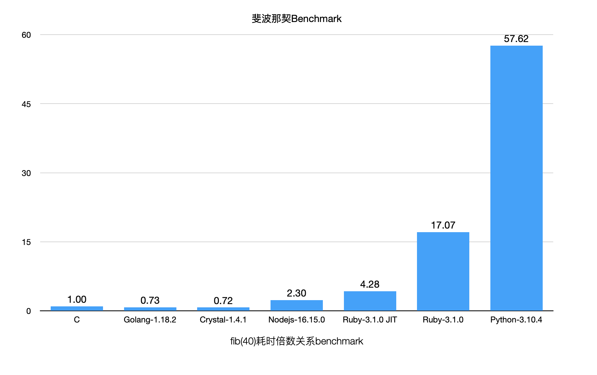

# fib-benchmark
斐波那契benchmark

# C

`gcc fib.c -o fib_c`

`time ./fib_c`

# Golang

`go build -o fib_go fib.go`

`time ./fib_go`

# Cystal

`crystal build --release fib.cr -o fib_cr`

`time ./fib_cr`

# Nodejs

`time node ./fib.js`

# Ruby

`time ruby ./fib.rb`

加上JIT

`time ruby --jit ./fib.rb`
# Python

`time python ./fib.py` 

# 结果

## Example 1

MacOSX X86_64(Intel 2.3 GHz 八核Intel Core i9)

